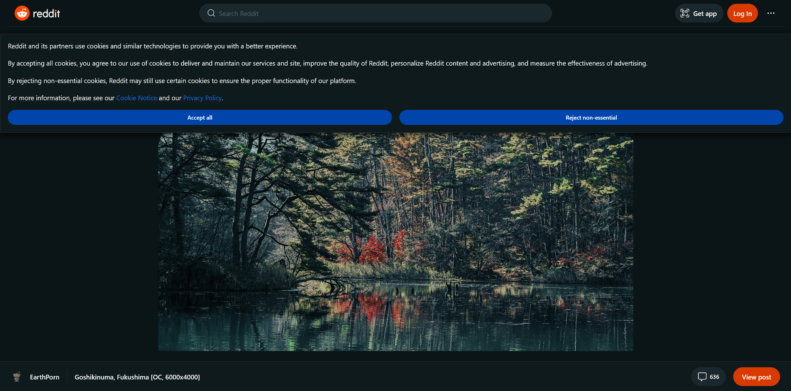

### Table of contents

- [Features](#features)
- [Comparison](#comparison)
- [Installation](#installation)
  - [Firefox](#firefox)
  - [Chromium](#chromium)
  - [Building from the source code](#building-from-the-source-code)
- [How it works](#how-it-works)

# Features

- Shows only the image file on `i.redd.it` and `external-preview.redd.it` and `reddit.com/media?url=IMAGE_URL` (*only on Firefox*) pages.
This improves loading speed, removes trackers and fixes the broken zooming.
- Redirects `preview.redd.it` to the `i.redd.it` equivalent.
This gets you the highest quality image, and you can download a PNG/JPEG instead of the default `preview.redd.it` WEBP (which you most likely don't want).
- Blocks an icon file request on the image file pages, since they don't have one.
The browser requests an icon for every page, but since they don't have one, blocking it is a *tiny* bit faster than sending the request and finding out that the destination doesn't exist.

# Comparison

*This was tested in a private window with no cache. The page in question is https://i.redd.it/dn4ox5cny11c1.jpg.*

Without extension:

Network log

Page screenshot

There's 81 requests in total, most of which (50+) are JavaScript requests.
This is just unnecessary tracking and bloat.

There's also a particularly nasty tracker which is activated every time you switch focus from the page.
It logs:

- What you viewed, although I don't know how specific this is.
- When you viewed it.
- How you viewed it (e.g. platform, screen size).
- Who viewed it (what account).
- If you have AdBlock.

I "guessed" this from the information that was being sent, but the info was very clearly labeled.
You can check this tracker if you go to this page (link above) and search for `events`.

---

With extension:

Network log

Page screenshot

Only 2 requests this time, these are:

- The image file.
- The `favicon.ico` file which is automatically requested by the browser. It's blocked, because it doesn't exist anyway.

The amount of data and especially load time is reduced.
Another advantage is that this page uses no JavaScript, but without the extension, the page will not work whatsoever without JavaScript.
This improves performance, but it might be important for you if you *really* care about your privacy,
and block as much JavaScript as you can.

# Installation

## Firefox

Get it from the [add-on store](https://addons.mozilla.org/en-US/firefox/addon/reddit-media-page-cleanup/).

## Chromium

*This applies to other Chromium browsers, such as Microsoft Edge, Opera or Brave.
This tutorial is for Chrome, but it should work for the others with some minor differences.
For example, instead of `chrome://extensions`, you use `edge://extensions` on Edge.*

1. Download `reddit-media-page-cleanup-chromium.release.zip` from the [latest release].
2. Extract it, you should get a folder called `chromium.min`. **Don't delete it, it will be uninstalled if you do.**
3. Go to `chrome://extensions`.
4. Turn on "Developer mode" in the top-right corner.
5. Click "Load unpacked" in the top-left corner.
6. Select the extracted folder.

The Chrome Web Store has a $5 fee for uploading an extension, so that's why I didn't bother uploading it there.

## Building from the source code

Clone the repo and run the [`build.sh`](https://github.com/tigerros/reddit-media-page-cleanup/blob/master/build.sh) file.
However, it uses binaries which it doesn't install automatically, so you need to install them yourself.
They are listed in the file.

# How it works

The extension simply removes the `Accept` header from the HTTP requests to the aforementioned pages.
The `Accept` header on those pages defaults to an image, meaning that an image file will be returned,
rather than the Reddit document.

When it comes to `reddit.com/media?url=IMAGE_URL`, the extension redirects to the `IMAGE_URL`,
and then removes the headers. Note that this redirect does not work on Chromium,
because it uses a different API which has absurdly strict restrictions.
Maybe I'm just not doing it right though.

[latest release]: https://github.com/tigerros/reddit-media-page-cleanup/releases/latest